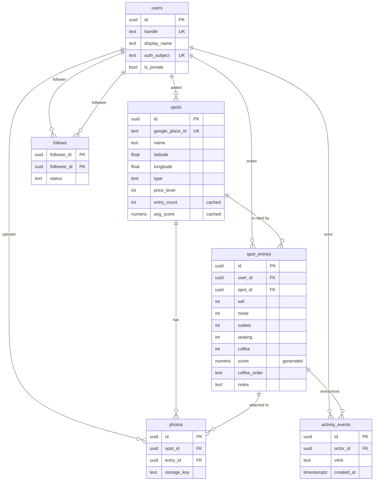

# Data model

Target model for Studease. See [schema.sql](schema.sql) for the DDL and
[api-contracts.md](api-contracts.md) for what crosses the wire.

## Entity relationship



## The central split

The single most important thing about this model, and the thing today's code gets wrong:

> **`spots` = facts about a place. `spot_entries` = one person's opinion of it.**

A café's address doesn't change because you rated it. Your rating doesn't change because
someone else rated it. Today these live in one table, which means two users can't both
rate the same café, and "Brew & Books" would exist twice in a social app.

Which side does a field belong on? Ask: *if two users both add this place, do they need
different values?* Address → no, it's a fact, put it on `spots`. Drink order → yes, put
it on `spot_entries`.

## Entities

### `users`

Identity only. No passwords — the API stores `(auth_provider, auth_subject)` from an
external identity provider and treats that pair as the login key.

- `handle` is the public `@name`. Unique **case-insensitively** — enforced by a unique
  index on `lower(handle)`, not by the column type.
- `is_private` gates whether follows need approval. See `follows.status`.
- `deleted_at` is a soft delete: a deleted user's spots survive (`spots.added_by` goes
  NULL), their entries cascade away.

### `spots`

One row per real-world place. **Globally shared** — not owned by whoever added it.

- `google_place_id` is `NOT NULL UNIQUE`. This is what stops duplicates. Adding a spot is
  "resolve a Place ID, then insert-or-return", never "insert whatever the user typed".
- `name`, `formatted_address`, `latitude`, `longitude`, `price_level`, `website_url`,
  `phone` are all snapshots from Places, refreshed on a schedule; `places_synced_at`
  records when. They're stored so lists render without an API call per row.
- **No hours column** (D8). Hours are fetched live from Places when a single spot is
  rendered. See "Places data and caching" below.
- `type` is `cafe | library | campus | other`, mapping to `SpotType` in
  `lib/design/theme.dart`. Derived from the Places `types` array at creation, then
  editable — Google's categories don't cleanly express "campus study room".
- `entry_count`, `avg_score`, and `avg_wifi`…`avg_coffee` are **cached aggregates**.
  They are derived data, recomputed when an entry is written. Never treat them as the
  source of truth; `spot_entries` is.

### `spot_entries`

The heart of the app. One row per (user, spot) — enforced by `UNIQUE (user_id, spot_id)`.
Rating a spot you've already rated is an **update**, not an insert (D2).

Five required 1–5 ratings:

| Column | 1 means | 5 means |
| --- | --- | --- |
| `wifi` | unusable or none | fast and reliable |
| `noise` | **loud** | **quiet** |
| `outlets` | no outlets | outlet at every seat |
| `seating` | never a free table | always somewhere to sit |
| `coffee` | bad | excellent |

> **`noise` is inverted on purpose.** 5 = quietest. Every category must be
> "higher is better" or the score formula and the green/amber/coral `Level` colors in
> `theme.dart` silently mean the opposite of what they show. If you ever add a category
> where high is bad (crowdedness, price), store it inverted too.

`coffee_order` and `notes` are optional free text (D6) — purely for your own recall,
never validated, never parsed.

`visibility` is `public | followers | private`, defaulting to `public`. Private entries
are excluded from the feed and from a spot's aggregates.

### `follows`

Composite primary key `(follower_id, followee_id)` — you can't follow someone twice, and
a `CHECK` stops you following yourself.

`status` is `pending | accepted`. Public accounts jump straight to `accepted`; private
accounts (`users.is_private`) create a `pending` row that the followee approves. Feed
queries filter on `status = 'accepted'`.

### `photos`

Attached to a spot always, and to an entry optionally:

- `entry_id IS NULL` → a photo of the place itself.
- `entry_id IS NOT NULL` → a photo someone took with their rating.

The composite foreign key `(entry_id, spot_id) → spot_entries (id, spot_id)` makes it
impossible to attach a photo to an entry for a *different* spot. That's a real bug class
closed off in the schema rather than in application code.

Postgres stores metadata only. Bytes live in object storage under `storage_key`; the
public URL is derived at read time so you can move buckets or add a CDN without a
migration.

### `activity_events`

An append-only log of things worth showing in a feed: `rated_spot`, `updated_rating`,
`added_spot`, `added_photo`, `followed_user`.

The feed is **fan-out on read** — query events by the actors you follow:

```sql
SELECT e.* FROM activity_events e
JOIN follows f ON f.followee_id = e.actor_id
WHERE f.follower_id = $1 AND f.status = 'accepted'
  AND e.visibility <> 'private'
  AND e.id < $2                      -- cursor
ORDER BY e.id DESC LIMIT 30;
```

This is the right choice at your scale and stays fine into the thousands of users. If
one user ever follows thousands of accounts, the fix is a per-recipient inbox table
(fan-out on write) — but don't build that now.

Give `id` a **UUIDv7** (`Guid.CreateVersion7()`, .NET 9). Because v7 is time-ordered, the
id doubles as a stable pagination cursor, which `created_at` can't be — two events in the
same millisecond would make a timestamp cursor skip or repeat rows.

## Derived values

Nothing computes a score in the UI. Two of these live in the database so all three
clients agree by construction.

### Entry score (0–10)

A `GENERATED ALWAYS AS ... STORED` column — the database computes it on every write, and
it cannot drift from the ratings:

```text
score = ROUND((wifi + noise + outlets + seating + coffee) * 0.4, 1)
```

Equal weights, sum of 5..25 mapped onto **2.0–10.0**. The floor is 2.0, not 0.0: a spot
you bothered to rate at all is never a zero, and the `scoreColor` thresholds in
`theme.dart` (9.0 / 8.0 / 7.0) already assume the interesting range is the top half.

To weight categories later, change the expression and add a migration — do *not* start
computing it client-side.

In EF Core: `.HasComputedColumnSql("...", stored: true)` and map the property as
read-only (`ValueGeneratedOnAddOrUpdate()`), or EF will try to INSERT into it.

### Spot aggregates

`avg_score`, `avg_wifi`…`avg_coffee`, `entry_count` — averages over non-private entries,
recomputed on entry insert/update/delete. Two options, pick one and be consistent:
recompute in the same transaction as the entry write (simple, correct, fine at this
scale), or a Postgres trigger. Application-side recompute-in-transaction is recommended
so the logic is visible in C#.

### Amenity levels

`Level.good / ok / rough` in `theme.dart` maps from a raw 1–5 rating: `>= 4` good,
`>= 3` ok, else rough. That already matches the 1–5 scale — no change needed, and the
`_levelFor` helper in `main.dart:43` is correct as written.

## Places data and caching

Hours come from the Places API at render time (D8), so a spot's detail response can
include today's `openUntil` and `isOpenNow` without any stored schedule going stale.

Two consequences to design around:

1. **Hours can be missing.** The API returns `null` when Places has no hours or the call
   fails. Every client must render a spot with no hours. Today `StudySpot.fromJson`
   (`lib/models/studyspot.dart`) *requires* `openUntil` to be a `String` and throws
   `FormatException` otherwise — that will crash on the first spot Google has no hours
   for. It needs to become nullable.
2. **Google's terms limit caching.** Place IDs may be stored indefinitely; other Places
   content may only be cached for a limited window (~30 days at time of writing). That's
   why `spots` stores a name/address/geo snapshot with `places_synced_at` and a refresh
   job, rather than treating the snapshot as permanent. Re-check the current Google Maps
   Platform terms before shipping.

A short-lived server-side cache (minutes) in front of the hours lookup is worth adding
when the Spots list starts showing "open now" for many spots at once.

## Conventions

- **Primary keys**: `uuid`, generated app-side with `Guid.CreateVersion7()` so they're
  time-ordered and index-friendly. Clients can mint an entry's id before it reaches the
  server, which makes optimistic UI and offline creation possible later.
- **Timestamps**: `timestamptz`, always UTC. Never `timestamp without time zone` — that's
  what the `ChangeOpenUntilTimestamp` migration papered over.
- **Naming**: `snake_case` tables and columns. EF's default is PascalCase; configure
  `UseSnakeCaseNamingConvention()` (via `EFCore.NamingConventions`) once rather than
  annotating every property.
- **Enums**: modeled as `text` + `CHECK` constraints, not native Postgres enum types.
  Native enums need `NpgsqlDataSourceBuilder.MapEnum` wiring and a migration to add a
  value; `text` + `CHECK` is a one-line change. If you'd rather have real enums, this is
  the place to switch.
- **Soft delete**: `deleted_at` on `users` and `photos` only. Entries and follows are
  hard-deleted.

## Build order

Full model documented, built in slices (D-scope):

**v1 — make the current UI correct.** `users` (minimal: id, handle, display_name, auth
columns; a single dev user is fine), `spots`, `spot_entries`. Endpoints: place search →
create-or-return spot, upsert my entry, list my entries ranked by score. This alone fixes
the score bug, the duplicate-spot problem, and the frozen `OpenUntil`.

**v2 — social.** `follows`, `activity_events`, the feed endpoint, real auth. The Profile
tab in the bottom nav becomes real.

**v3 — photos.** `photos` plus object storage and an upload endpoint.

Nothing in v2 or v3 changes a v1 table, which is the point of designing them now.

## Migrating off today's schema

Today: one `StudySpots` table, `int` identity, 10 columns, five seed rows.

**Recommendation: don't write a data migration.** The five rows in `frontend/db.json` are
fixtures, not data. Add one EF migration that drops `StudySpots` and creates the new
tables, then re-seed by resolving the five names through Places. `Program.cs` already
calls `db.Database.Migrate()` at startup, so it applies on the next run.

Field-by-field, for when you re-seed:

| Today | Becomes | Note |
| --- | --- | --- |
| `Id` (int) | `spots.id` (uuid) | New ids; nothing references the old ones |
| `Name` | `spots.name` | |
| `Address` | `spots.formatted_address` + `latitude`/`longitude` | From Places, not the typed string |
| `HasCharging` (bool) | `spot_entries.outlets` (1–5) | true → 4, false → 2 |
| `Seating` (int, a **seat count**: 15–40) | `spot_entries.seating` (1–5) | Not a rescale — it's a different question ("are seats available?"). Re-enter by hand |
| `CoffeeQuality` (int, 1–10 in the fixtures) | `spot_entries.coffee` (1–5) | `ROUND(q / 2)` |
| `GeneralPrice` (`"$$"`) | `spots.price_level` (0–4) | Length of the string; sourced from Places going forward |
| `OpenUntil` (DateTime) | *dropped* | Live from Places (D8) |
| `DrinkOrder` | `spot_entries.coffee_order` | |
| `ExtraNotes` | `spot_entries.notes` | |
| — | `spot_entries.wifi`, `noise` | New; no source data, enter by hand |

Client-side fallout, all of it required:

- `lib/models/studyspot.dart` — split into `Spot` and `SpotEntry`; `openUntil` becomes
  nullable; `id` becomes `String`; drop the local score assumption at `main.dart:38`.
- `main.dart:53` — `SpotType` stops being hardcoded to `cafe` and reads `spot.type`.
- `main.dart:62` — delete the `score` getter; the server sends the score.
- `frontend/src/services/study-spot.service.ts` — the `StudySpot` interface splits the
  same way; the `db.json` import and `openUntil: new Date(...)` mapping go away.
